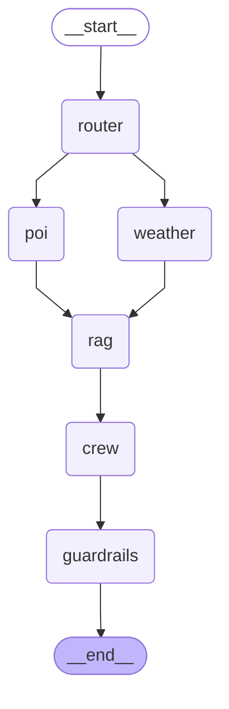

*What does the application does?*

**What tools have been used by the project?**
1. Open-Meteo (https://github.com/open-meteo/open-meteo): Open-Meteo is an open-source weather API and offers free access for non-commercial use. No API key is required.
2. Nominatim (https://github.com/osm-search/Nominatim): Nominatim (from the Latin, 'by name') is a tool to search OpenStreetMap data by name and address (geocoding). 
It's **search** API is used to list POIs (Point of Interests). The current project uses the API to get 'parks' for the given location (example- 'Cancun, Mexico').

**NOTE:** If while testing you face timeout issues then increase the **HTTP_TIMEOUT_SECONDS** value in **config.py** file

**Implementation details:**
1. **config.py** contains the URL to these services.
2. **weather.py** is responsible for connecting with Open-Meteo. To test the functionality, 
go to the directory above travel_assistant and executes the following command from the terminal:
     _python -m planner.tools.weather_
3. **interests.py** is responsible for connecting with Nominatim. To test the functionality, 
go to the directory above travel_assistant and executes the following command from the terminal:
     _python -m planner.tools.interests_
4. *interests_mcp_server.py* defines the MCP server that connects with **search_pois** API of OpenStreetMap to 'parks' in the supplied location (example- 'Cancun, Mexico')
5. *interests.py* defines the **search_pois** API. It makes call to OpenStreetMap with the supplied location and returns the 'parks' found in that location.
6. **retriever.py** calls Wikipedia's REST API with the location (represented by the {title} parameter) to get facts about the place. 
The intent is that the information returned from OpenStreetMap are grounded in the information contained from Wikipedia. 
The **config.py** file contains the link to the Wikipedia REST API:  https://en.wikipedia.org/api/rest_v1/page/summary/{title}

**Tests**
You can run all the tests contained in **/planner/tests** by using this command:
_python -m pytest planner/tests/ -v_

1. **_mcp_test.py_** performs end-to-end testing of MCP client/server by calling **interest_mcp_client.py** 
You can test end-to-end MCP by running this command: 
_python -m pytest planner/tests/mcp_test.py::test_mcp_poi_roundtrip -v -s_

2. **_wikipedia_rag_test.py_** tests the Wikpedia REST API called via **retriever.py**
You can run the test by executing:
_python -m pytest planner/tests/wikipedia_rag_test.py -v -s_

3. _**crew_test.py**_ tests the CrewAI agents (Trip Planner, Itinerary Executor) that are responsible for building the travel plan along with suggesting an itinerary.

**Design decisions**
**1. Why wrap OpenStreetMap under MCP and not Weather data from Opne-Meteo?**
MCP is used specifically for POIs (Point Of Interests) as you can easily switch the provider in the backend if the need arises.

Router treats an incomplete request as a hard stop, not a retry target — the user, not the LLM, is the authority on missing trip details, so the system asks rather than guesses.

