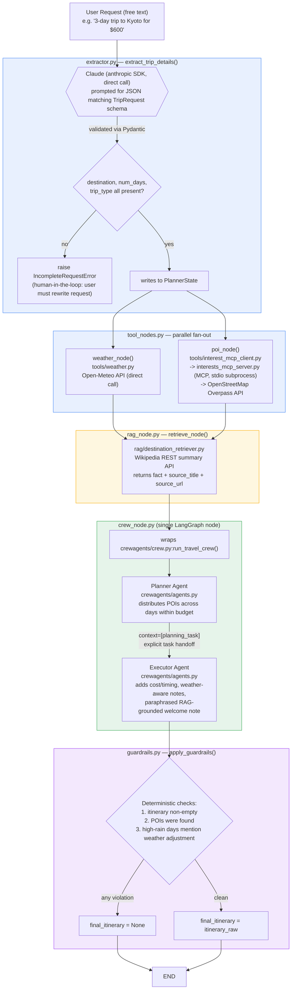

# Architecture — Travel Itinerary Planner

## System Diagram

*Diagram reflects `planner/orchestrator/graph.py` exactly — node names, edges, and the two-incoming-edge structure into `rag` are all as implemented, not idealized. If this diagram and the code ever diverge, `graph.py` is the source of truth; regenerate via `build_graph().get_graph().draw_mermaid()`.*

**No memory subsystem is diagrammed** — the only state that exists is `PlannerState`, scoped to a single request and discarded after. See Patterns Used and Limitations for why persistent memory was deliberately not built.

---

## Component Descriptions

| Component | File | Responsibility |
|---|---|---|
| **Extractor** | `orchestrator/extractor.py` | Calls Claude directly to pull structured trip details (destination, num_days, budget_usd, trip_type) from free text, validated via Pydantic. Raises `IncompleteRequestError` rather than guessing if required fields are missing. |
| **Weather tool** | `tools/weather.py` | Geocodes the destination and fetches a daily forecast from Open-Meteo (public, keyless). Called directly, no MCP. |
| **POI tool** | `tools/interests.py` | Geocodes via Nominatim, queries OpenStreetMap's Overpass API for POIs, with retry/backoff for Overpass's intermittent 504s. Scoped to the `park` category only (deliberate latency/payload tradeoff). |
| **POI MCP server/client** | `tools/interests_mcp_server.py`, `tools/interest_mcp_client.py` | Exposes `interests.search_pois()` as an MCP tool over stdio; the client launches the server as a subprocess and calls it. This is the project's one MCP integration. |
| **RAG retriever** | `rag/destination_retriever.py` | Fetches a short grounded Wikipedia summary for the destination, returning the fact plus a citation URL. |
| **Tool/RAG adapter nodes** | `orchestrator/tool_nodes.py`, `orchestrator/rag_node.py` | Thin LangGraph node wrappers converting the above tools' plain function signatures into `PlannerState` reads/writes. |
| **CrewAI Planner/Executor** | `crewagents/agents.py`, `crewagents/tasks.py`, `crewagents/crew.py` | Two-agent crew: Planner distributes POIs across days; Executor adds cost/timing and a weather- and RAG-grounded welcome note. Explicit handoff via `context=[planning_task]`. |
| **crew_node** | `orchestrator/crew_node.py` | Wraps the entire CrewAI crew as a single LangGraph node — the seam between LangGraph (infrastructure) and CrewAI (agent collaboration). Catches exceptions from the crew and logs them to `guardrail_violations`, consistent with `tool_nodes.py`'s failure handling. |
| **Guardrails** | `orchestrator/guardrails.py` | Deterministic, non-LLM final checks: itinerary non-empty, POIs found, high-rain days acknowledged. Any violation withholds `final_itinerary`. |
| **Graph wiring** | `orchestrator/graph.py` | Builds the LangGraph `StateGraph`: extractor → parallel weather/POI → merge at RAG → crew → guardrails → END. |
| **Shared state** | `orchestrator/planner_state.py` | `PlannerState` TypedDict — the shared workspace every node reads/writes. |
| **CLI entry point** | `main.py` | Interactive prompt → `graph.invoke()` → prints itinerary, guardrail violations, or the `IncompleteRequestError` message. |
| **Eval harness** | `eval/harness.py` | Runs 13 fixed test cases through the graph, scoring task success rate, citation coverage, weather compliance, and latency, plus a weather-removed ablation. |

---

## Design Decisions

### 1. LangGraph owns infrastructure; CrewAI owns agent collaboration
**Decision:** Split responsibilities rather than using one framework for everything — LangGraph handles the deterministic spine (extraction, parallel tool fan-out, guardrails), CrewAI handles the Planner→Executor handoff, wrapped as a single opaque LangGraph node (`crew_node.py`).
**Alternative rejected:** Doing it all in one framework.
**Why:** LangGraph's explicit graph has no clean primitive for role-based agent collaboration; CrewAI doesn't provide the auditable, inspectable state-at-every-step that the deterministic tool/guardrail logic benefits from. Each framework is used where it's strongest.

### 2. MCP wraps the POI tool only, not weather
**Decision:** `interests.py` is wrapped in an MCP server/client pair; `weather.py` is called directly.
**Alternative rejected:** Wrapping both tools in MCP for consistency.
**Why:** Weather is a single stateless call with no need for a swappable-provider boundary. MCP's protocol overhead (subprocess management, serialization, an added failure surface) is justified specifically for POI, which is more likely to change data providers later and benefits from a clean client/server boundary.

### 3. POI search is scoped to a single category (`park`)
**Decision:** `interests.py`'s `CATEGORY_TAGS` includes only `park`, not the originally designed museum/attraction/restaurant/park set.
**Alternative rejected:** Querying all four categories per request.
**Why:** Each additional category adds another Overpass tag filter, increasing response payload size and round-trip latency — a real cost given Overpass's public instance is already prone to timeouts under load. This is a deliberate latency/coverage tradeoff.
**Consequence:** Itinerary recommendations outside of parks (restaurants, museums) come from the LLM's general knowledge, not from grounded OSM data — worth being precise about this distinction when discussing citation/grounding coverage.

### 4. Incomplete requests are rejected, not retried against the LLM
**Decision:** `extractor.py` raises `IncompleteRequestError` and stops when required fields (destination, num_days, trip_type) can't be extracted, rather than retrying the LLM call or silently defaulting.
**Alternative rejected:** Retry with a clarifying re-prompt, or fill in defaults.
**Why:** The user, not the model, is the authority on missing trip details — guessing risks producing a confidently wrong itinerary for a request that was never actually complete. This is the project's lightweight human-in-the-loop mechanism.

### 5. Weather is a soft prompt signal, verified structurally by a guardrail
**Decision:** Weather data is passed to the Executor agent as prompt context (with an explicit instruction to avoid outdoor activities on high-rain days), and `guardrails.py` separately checks whether the output text acknowledges high-rain days.
**Alternative considered:** Cut weather entirely, since its influence on LLM output can't be guaranteed by a prompt instruction alone.
**Why kept:** Weather is also this project's second parallel branch (alongside POI) — removing it would remove the parallelization pattern's second leg. The guardrail check converts an otherwise-unverifiable soft signal into something checkable: the eval harness's ablation (weather stripped out) demonstrates whether the compliance rate actually depends on weather being present, rather than assuming it does.

---

## Patterns Used

| Pattern | Implementation |
|---|---|
| **Control flow — parallelization** | `extractor → weather_node + poi_node` run concurrently (both only depend on `destination`/`num_days`, set by extraction); `rag_node` waits for both before proceeding. No conditional routing/branching is implemented — every request follows the same static path (see Limitations re: `trip_type` being extracted but unused for branching). |
| **Tool use (≥2 tools)** | `weather.py` (Open-Meteo, direct call) and `interests.py` (OpenStreetMap, via MCP). |
| **MCP integration (≥1 server)** | `interests_mcp_server.py` (FastMCP, stdio transport) + `interest_mcp_client.py`, launched as a subprocess by `poi_node`. POI retrieval genuinely goes over the MCP protocol, not a direct in-process call. |
| **Planning / multi-agent (2+ agents, handoff)** | CrewAI Planner agent → Executor agent, with an explicit `context=[planning_task]` handoff in `crewagents/tasks.py` — the Executor's prompt is built from the Planner's actual finished output, not just run in sequence. |
| **Reliability / oversight (guardrails + eval harness)** | `guardrails.py`'s three deterministic checks, plus `eval/harness.py`'s 13-case suite with task-success-rate, citation-coverage, weather-compliance, and latency metrics, and a weather-removed ablation. |

**Patterns deliberately excluded:**

- **Reflection/self-critique** — `guardrails.py` checks and blocks (`final_itinerary = None`), but never triggers a revision loop back to the crew. A guardrail failure is a terminal state for the request. Deterministic guardrails were judged sufficient for the failure modes this system needs to catch; an LLM self-critiquing its own itinerary would add latency/cost without a clear case for catching something the guardrails wouldn't.
- **Memory (≥2 types)** — every request is a one-shot, stateless planning session. There's no returning-user concept or multi-turn context to preserve, so episodic/semantic memory would be simulating a need the product doesn't actually have.
- **Full human-in-the-loop (interactive approval checkpoint)** — not implemented as a mid-pipeline pause/approve step. `IncompleteRequestError` is a lightweight, related mechanism (rejecting ambiguous input rather than guessing) but is not counted as this pattern, since it's a pre-flight validation, not an in-flight approval checkpoint.

---

## Model / Provider Choice

**Anthropic Claude (`claude-sonnet-5`)**, called directly via the `anthropic` Python SDK in `extractor.py`, and via CrewAI's `LLM` class (`anthropic/{model}`) in `crewagents/agents.py` — one model, configured once in `config.py`, used consistently across both the extraction step and both CrewAI agents.

No provider-abstraction layer (e.g. `litellm`) is used — this was a deliberate choice to keep both call sites simple and directly inspectable, at the cost of the system not being provider-swappable without code changes. No Claude-native structured-output features (tool-use/function-calling) are used for extraction — `extractor.py` uses plain prompt-based JSON generation validated with Pydantic instead, which is a pattern that would generalize to other providers' basic chat-completion endpoints even though the current SDK call is Anthropic-specific.

## Secret Handling

`ANTHROPIC_API_KEY` is stored in a local `.env` file (excluded from git via `.gitignore`), loaded via `python-dotenv`'s `load_dotenv()`. `load_dotenv()` is called at the top of `main.py`, before any module that imports `config.py` — this ordering is required: `config.py` reads `ANTHROPIC_API_KEY` from the environment at import time, and a later `load_dotenv()` call cannot retroactively populate an already-executed import. `config.py` is the single place in the codebase that reads the key from the environment; every other module imports it from there rather than calling `os.environ.get(...)` independently.

## Limitations

- **RAG title-matching gap.** `destination_retriever.py` passes the destination string to Wikipedia's title lookup with only spaces replaced by underscores. Country-suffixed strings like `"Kyoto, Japan"` (as commonly produced by `extractor.py`) will not match Wikipedia's actual page title `"Kyoto"`, silently returning no RAG context — indistinguishable from "no request failure" or "genuinely no matching page."
- **POI retrieval depends on a free, unauthenticated third-party API** (Overpass) with no uptime guarantee; mitigated with retry/backoff, but intermittent 504s are a known, observed failure mode during development.
- **`trip_type` is extracted but not consumed.** Neither `graph.py` nor `crew_node.py` branches or behaves differently based on `single_city`/`multi_city`/`day_trip` — it's present in state and printed in `main.py`'s output, but has no functional effect on the itinerary produced.
- **POI coverage is limited to parks.** Restaurant/museum/attraction recommendations in the final itinerary are not grounded in real OSM data — they come from the LLM's general knowledge, since `interests.py` is deliberately scoped to a single category.
- **`rag_node` waits unnecessarily on both parallel branches.** It only depends on `destination` (available immediately after extraction) but is wired with incoming edges from both `weather` and `poi`, adding avoidable latency to every request.
- **No verification that generated text is actually grounded in retrieved RAG facts** — the citation trail (source URL) is real and verifiable, but nothing checks whether the Executor agent's welcome note actually reflects the retrieved Wikipedia extract versus the LLM's own training-data knowledge of the destination.
- **The "no more than 5 activities per day" instruction to the Planner agent is not structurally enforced** — it's a soft LLM instruction with no guardrail counterpart, unlike the weather-compliance case.
- **Itinerary quality is not evaluated, only structural validity** (see `eval/eval_report.md`) — whether the itinerary is actually good, not just present and non-empty, still requires human review.
- **CrewAI agent output is non-deterministic** — eval metrics may vary run-to-run given the same test case.
- **No memory across sessions** — every request is independent; a returning user gets no benefit from prior interactions.
