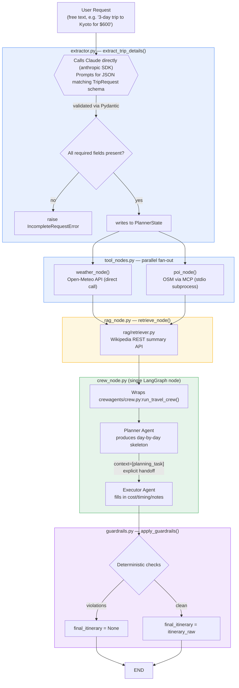

## Components/File references

**[`planner/config.py`](planner/config.py)** — Central configuration: API endpoints (Open-Meteo, Nominatim, Overpass, Wikipedia) and the Anthropic API key/model, loaded from environment variables. Every other module imports from here rather than duplicating `os.environ.get(...)` calls, keeping secret access and endpoint URLs in one auditable place.

**[`planner/orchestrator/extractor.py`](planner/orchestrator/extractor.py)** — Calls Claude directly to extract structured trip details (destination, num_days, budget_usd, trip_type) from the user's free-text request, validated against a Pydantic model. If required fields are missing, raises `IncompleteRequestError` rather than guessing — pushing ambiguity back to the user instead of the LLM inferring defaults.

**[`planner/orchestrator/planner_state.py`](planner/orchestrator/planner_state.py)** — Defines `PlannerState`, the shared `TypedDict` that every LangGraph node reads from and writes to. This is the system's "shared workspace" — the full pipeline state is inspectable at any node rather than hidden across function calls.

**[`planner/orchestrator/tool_nodes.py`](planner/orchestrator/tool_nodes.py)** — Thin LangGraph adapters around the weather and POI tools, converting their plain function signatures into node functions that read/write `PlannerState`. Both nodes catch exceptions and degrade gracefully (empty forecast/POI list plus a logged violation) rather than crashing the graph.

**[`planner/orchestrator/rag_node.py`](planner/orchestrator/rag_node.py)** — LangGraph adapter around `retriever.py`; fetches Wikipedia-grounded context for the destination and writes it to `state["rag_context"]` for the crew to cite.

**[`planner/orchestrator/crew_node.py`](planner/orchestrator/crew_node.py)** — Wraps the CrewAI Planner→Executor crew as a single LangGraph node, passing destination, POIs, weather, budget, and RAG facts into `run_travel_crew()` and writing the raw itinerary output back to state. This is the architectural seam between LangGraph (infrastructure) and CrewAI (agent collaboration) — see Design Decision #1.

**[`planner/orchestrator/guardrails.py`](planner/orchestrator/guardrails.py)** — Deterministic, non-LLM checks run after the crew produces an itinerary: output non-empty, POIs were actually found, and high-rain-probability days are acknowledged in the text. If any check fails, `final_itinerary` is withheld (`None`) rather than shipped with unverified problems.

**[`planner/orchestrator/graph.py`](planner/orchestrator/graph.py)** — Builds and wires the LangGraph `StateGraph`: extractor → parallel weather/POI fan-out → merge at RAG → crew → guardrails → END. This file is the architecture diagram expressed as code and should be treated as the source of truth if the two ever diverge.

**[`planner/tools/weather.py`](planner/tools/weather.py)** — Geocodes the destination and fetches a daily forecast (temperature, precipitation probability) from the free, keyless Open-Meteo API. Called directly (not via MCP) since it's a single stateless call with no need for a swappable-provider boundary — see Design Decision #2.

**[`planner/tools/interests.py`](planner/tools/interests.py)** — Geocodes the destination via Nominatim and queries OpenStreetMap's Overpass API for tagged POIs within that bounding box, with retry/backoff to handle Overpass's intermittent 504 timeouts. The search is deliberately scoped to the `park` category only, rather than the full museum/attraction/restaurant/park set, trading itinerary variety for smaller Overpass payloads and lower latency.

**[`planner/tools/interests_mcp_server.py`](planner/tools/interests_mcp_server.py)** — Exposes `interests.search_pois()` as an MCP tool (`search_interests`) over stdio transport, using FastMCP. This is the server half of the project's one MCP integration, chosen specifically for POI (not weather) since it's the tool most likely to swap providers later.

**[`planner/tools/interest_mcp_client.py`](planner/tools/interest_mcp_client.py)** — Client-side MCP wrapper: launches `interests_mcp_server.py` as a subprocess and calls its `search_interests` tool, aggregating all returned content blocks into a flat list of POI dicts. This is what `tool_nodes.py` actually calls, so POI retrieval genuinely goes over the MCP protocol rather than a direct in-process import.

**[`planner/rag/retriever.py`](planner/rag/retriever.py)** — Fetches a short grounded summary of the destination from Wikipedia's REST API (public, keyless), returning the fact alongside its source title and citation URL. Returns an empty list rather than raising if no matching page is found, so a missing Wikipedia article degrades gracefully instead of breaking the pipeline.

**[`planner/crewagents/agents.py`](planner/crewagents/agents.py)** — Defines the two CrewAI agents: a Planner (distributes POIs across days within budget) and an Executor (adds cost/timing detail and a grounded welcome note). Both use the same Claude LLM instance, configured once from `config.py`.

**[`planner/crewagents/tasks.py`](planner/crewagents/tasks.py)** — Defines the CrewAI tasks bound to each agent, including the explicit `context=[planning_task]` handoff that lets the Executor's task see the Planner's finished output — this is the concrete evidence of the multi-agent pattern, not just two functions called in sequence. The Executor's task also encodes the weather-adjustment guardrail's counterpart instruction (avoid outdoor activities on high-rain days) and requires the welcome note to paraphrase, never quote, RAG-sourced facts.

**[`planner/crewagents/crew.py`](planner/crewagents/crew.py)** — Assembles the Planner and Executor agents plus their tasks into a sequential CrewAI `Crew` and runs `kickoff()`. This is the function `crew_node.py` calls; everything inside it is invisible to LangGraph, which only sees one node.

**[`planner/eval/harness.py`](planner/eval/harness.py)** — Runs 13 fixed test cases (well-formed requests, an edge-case destination, a multi-city request, two deliberately incomplete requests, and one unresolvable destination) through the full graph, scoring task success rate, citation coverage, weather compliance, and latency. Includes one ablation (weather stripped out) to verify the weather-compliance guardrail is actually load-bearing rather than decorative.

**[`planner/main.py`](planner/main.py)** — ⚠️ Currently a stub (`load_dotenv` is referenced without being called — missing `()`). Needs to be built out as the actual CLI/demo entry point before the recorded presentation.

## System Architecture

